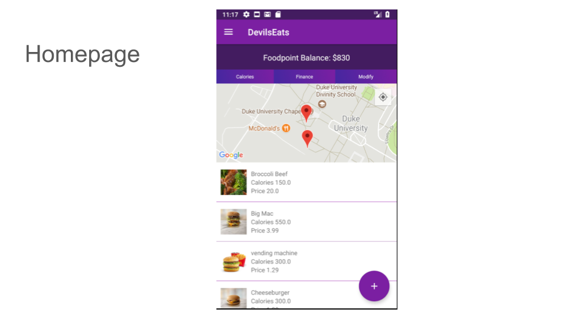
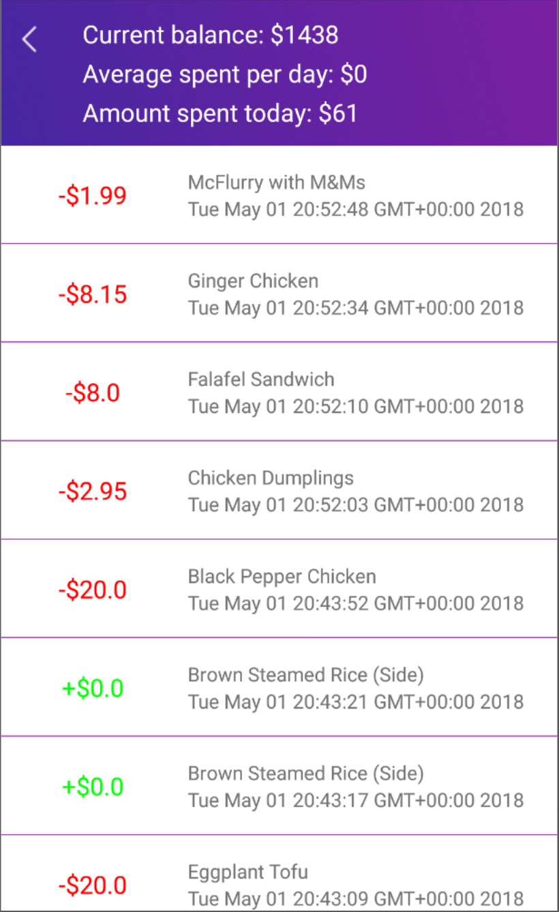
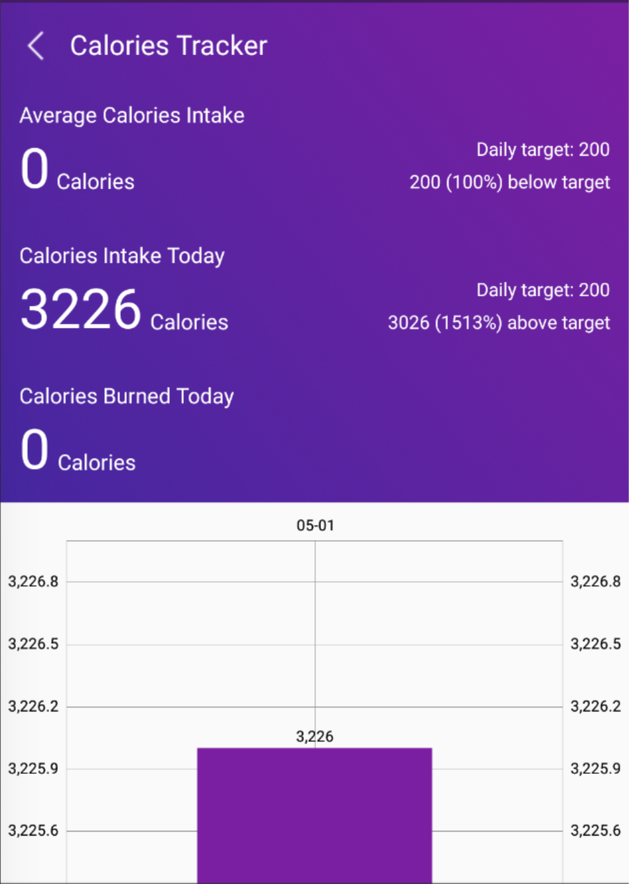

# Devil Eats
Devils Eats is a mobile application for android aimed at students of Duke University in order to make it easier for them to manage and understand their eating habits on campus. 

 
    
 

 

 
    
 

## Problem
Duke University is not free from the high rates of obesity and eating disorders that affect the United States. Currently tracking calorie intake or food point usage is not easy, our app DevilsEats provides a solution.

### User Documentation

DevilsEats is a mobile application for android aimed at students of Duke University in order to make it easier for them to manage and understand their eating habits on campus. The app helps students have a better understanding of how they use their food points on meals at campus eateries every day, while also making it easy for them to track calories in the food they are consuming. The exploration feature also allow students to view locations, menus and nutritional information of various eateries on campus. The memories feature allows students to take pictures of yummy meals that they will want to remember to share and come back for in the future. The memories feature also allows for easier visualization of what a certain meal looked like weeks in the past.

## Features

 ### Finances: 
 View timeline of food transactions: statistics on average amount spent per day, amount spent today and balance

 
    
 

 ### Calorie Tracker: 
 Average calories intake, calorie intake today, calories burned today, target/goal tracking, data visualization of caloric intake
 
 
 
    
 

 ### Profile creation: 
 Name, initial foodpoint balance, daily caloric goal, foodpoint balance modification (adding points)

 ### Adding meals to your timeline: 
 Search for dish/restaurant, view menus of specific restaurants or input custom meal

 ### Map: 
 View your current location and duke restaurant options nearby

 ### Moments: 
 Camera and image saving feature

## Setup
1. Download DevilsEats from Google Play Store
2. Sign Up for DevilsEats account
3. You will be prompted to agree to DevilsEats using your location during app usage
4. Press ‘Allow’
5. You can now freely input your meal data
6. Add your daily calorie intake target

## Developer Documentation
### Google Maps: 
Markers for restaurants, user’s current location

### Google Fit:
Pulling data on how many calories user burns when doing “active” activitites (using accelerometer, location data)

### MaterialSearchBar: 
Search for restaurants and dishes (SelectRestaurantActivity, SelectMealActivity)

### MPAndroidChart: 
Pulls data from firebase and displays it in meaningful bar charts

### Firebase: 
Realtime database, authentication, cloud storage

### Firebase UI: 
Logging in

### Room Persistence Library: 
Saving picture moments in SQLite database

### Camera: 
Taking images for moments

## Breakdown of Classes, Activities & Adapters
Main Pages

## Testing
Because of our heavy implementation of Firebase, implementing JUnitTests was not feasible. Since JUnitTest cannot access all the Android libraries we use, it is unable to retrieve information from our Firebase, which is used in most of our classes.
InstrumentedTests were also too complex since we would need to login and allow authentication to Firebase to access all significant/testable classes. A lot of our testing was done using emulator and hardware phone by debugging with log printing. Also, Firebase sends crash reports if code isn’t working.
